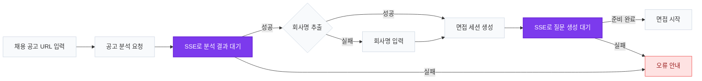

### 💬 음어그

> 채용 공고를 분석해 맞춤 면접 질문을 생성하고,  
> 답변의 습관어·침묵·논리 구조를 분석하는 AI 면접 스피치 코칭 서비스

<p>
  <a href="https://u-u-g-frontend.vercel.app/">
    <strong>🌐 서비스 둘러보기</strong>
  </a>
  &nbsp;|&nbsp;
  <a href="https://blog.swyp.im/building-an-ai-interview-coach/">
    <strong>🏆 수상 인터뷰</strong>
  </a>
</p>

🏆 **SWYP 웹 13기 대상 수상**

<details>
<summary><strong>🔑 테스트 계정 확인하기</strong></summary>

<br />

- **아이디:** `uug.swyp@gmail.com`
- **비밀번호:** `uugswyp1234!`

> 해당 계정은 서비스 체험을 위한 테스트 전용 계정입니다.

</details>

<br />


## 🚀 화면 구성

### 1. 홈 및 연습 관리


### 2. 실시간 문답 진행


### 3. 면접 답변 연습


### 4. AI 분석 리포트


## 🎯 핵심 기능

- 습관어 및 침묵 구간 실시간 감지
- 연습 중 즉각적인 시각 피드백 제공 (음량·데시벨·침묵 경고)
- 답변별 AI 분석 리포트 제공
- 연습 이력·랭킹을 통한 반복 학습 유도


## 🔄 면접 생성 흐름 구조도

채용 공고를 분석해 맞춤 면접 질문을 생성하고, 질문이 준비되면 면접을 시작하는 전체 흐름입니다.



### 구현 방식

- **공고 분석** : `POST /job-postings`
- **공고 분석 결과** : `SSE /job-postings/{uuid}/stream`
- **공고 상세 조회** : `GET /job-postings/{uuid}`
- **회사명 보완** : `PATCH /job-postings/{uuid}`
- **면접 세션 생성** : `POST /interview-sessions`
- **질문 생성 결과** : `SSE /interview-sessions/{uuid}/stream`

공고 분석과 질문 생성은 시간이 소요되는 작업이므로 **SSE(Server-Sent Events)** 를 이용해 완료 이벤트를 수신했습니다. 
공고에서 회사명을 추출하지 못한 경우에는 사용자 입력을 받아 공고 정보를 보완한 뒤 동일한 흐름으로 면접 세션을 생성하도록 구현했습니다.


### ⚙️ Core

- **Bun** — 빠른 패키지 관리 및 실행 환경
- **Next.js 16 (App Router)** — 라우트 그룹 기반의 React 프레임워크 (Turbopack)
- **React 19** — UI 라이브러리
- **TypeScript 5** — 정적 타입 기반 안정적인 개발 환경


### 🎨 Styling

- **Tailwind CSS 4** — 빠르고 일관된 UI 개발을 위한 스타일링
- **Pretendard (subset)** — 초기 preload 용량을 줄인 서브셋 폰트


### 🔄 Data Fetching

- **TanStack Query 5** — 서버 상태 관리 및 캐싱 처리
- **Axios** — REST API 통신 (`publicClient` / `privateClient` + 토큰 자동 재발급)
- **@microsoft/fetch-event-source** — 인증 헤더를 실은 SSE 실시간 스트림 수신


### 🌐 Browser API

- **Web Speech API** — `ko-KR` 실시간 음성 인식(STT)으로 습관어 텍스트 추출
- **Web Audio API** — 음량/데시벨 측정 및 침묵 구간 감지


### 🧹 Code Quality

- **ESLint** — 코드 품질 및 잠재적 오류 방지
- **Prettier** — 코드 스타일 자동 정렬


### 🧪 Testing

- **Playwright** — 사용자 시나리오 기반 E2E 테스트


### 📈 Analytics

- **Google Analytics 4** — 사용자 행동 분석


## 🚀 주요 기능

- 🔐 **인증** — 이메일 회원가입·로그인, 소셜(OAuth2) 로그인, 비밀번호 재설정, 토큰 자동 재발급
- 🧾 **채용공고 맞춤 면접** — 원티드·잡코리아 공고 URL 분석(크롤링) → AI 맞춤 질문 자동 생성
- 🎤 **실시간 스피치 분석** — 습관어(음/어/그), 발화 음량·데시벨, 침묵 구간 실시간 감지
- 🔴 **실시간 진행 상태 수신** — SSE로 공고 분석·질문 생성·리포트 완료 상태를 실시간 반영
- 📊 **AI 분석 리포트** — 질문별 답변 분석 및 종합 리포트 제공
- 🗂️ **연습 이력 관리** — 지난 면접 리포트 조회 및 상세 확인
- 🏆 **랭킹** — 연습 결과 기반 랭킹 제공
- 🗓️ **면접 커리큘럼·일정** — 홈 화면 일정 관리 및 추천 커리큘럼
- 👤 **프로필 관리** — S3 기반 프로필 이미지 업로드/삭제, 닉네임·비밀번호 변경


## 🗂️ 프로젝트 구조

```text
src/
├── app/                # App Router
│   ├── (auth)/         # 비로그인 영역 (login, sign-up, reset-password, oauth2)
│   └── (main)/         # 로그인 영역 (home, interview, history, ranking, setting)
├── apis/               # 도메인별 API 클라이언트
│   └── common/         # publicClient · privateClient · refresh · httpError
├── components/         # 도메인별 UI 컴포넌트 (+ common)
├── hooks/              # useAudioAnalyzer · useSpeechRecognition · useWaitForSessionQuestions ...
├── utils/              # tokenStorage · date · reportScore ...
├── constants/          # 정규식 등 상수
├── types/              # 공통 타입
└── assets/             # 이미지 · 아이콘 · 폰트
```


## 🛠️ Getting Started

### 1. 환경 변수 설정

프로젝트 루트에 `.env` 파일을 만들고 아래 값을 채워주세요.

```bash
# 백엔드 API 베이스 URL
NEXT_PUBLIC_API_BASE_URL=http://localhost:8080/api

# Google Analytics 4 측정 ID
NEXT_PUBLIC_GA_ID=G-XXXXXXXXXX
```

### 2. 실행

```bash
bun install
bun dev
```

> `bun start`로 프로덕션 빌드를 3000번 포트에서 실행할 수 있습니다.


## 📜 Scripts

```bash
bun dev              # 개발 서버 (Turbopack)
bun build            # 프로덕션 빌드
bun start            # 프로덕션 서버 실행 (:3000)
bun test:playwright  # E2E 테스트
```


## 🧹 Code Convention

```bash
bun lint         # lint (자동 수정)
bun lint:check   # lint 검사만
bun format       # 코드 포맷팅
bun type-check   # 타입 검사
```


## 💡 특징

- 🎯 "음 / 어 / 그"와 같은 **습관어에 특화**된 서비스
- 🔴 **SSE 실시간 스트림**으로 분석·생성 과정을 지연 없이 반영 (실패 시 폴링 폴백)
- 📊 **AI 기반 피드백** 리포트 시스템
- 🔁 **리포트 + 이력 + 랭킹**으로 반복 학습을 유도하는 구조


## 👀 타겟 사용자

- 🎓 면접을 준비하는 취업 준비생
- 💼 발표를 준비하는 직장인
- 🗣️ 말버릇을 고치고 커뮤니케이션 능력을 개선하고 싶은 사용자
