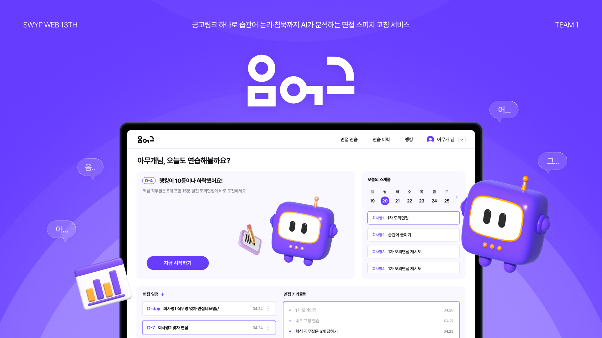
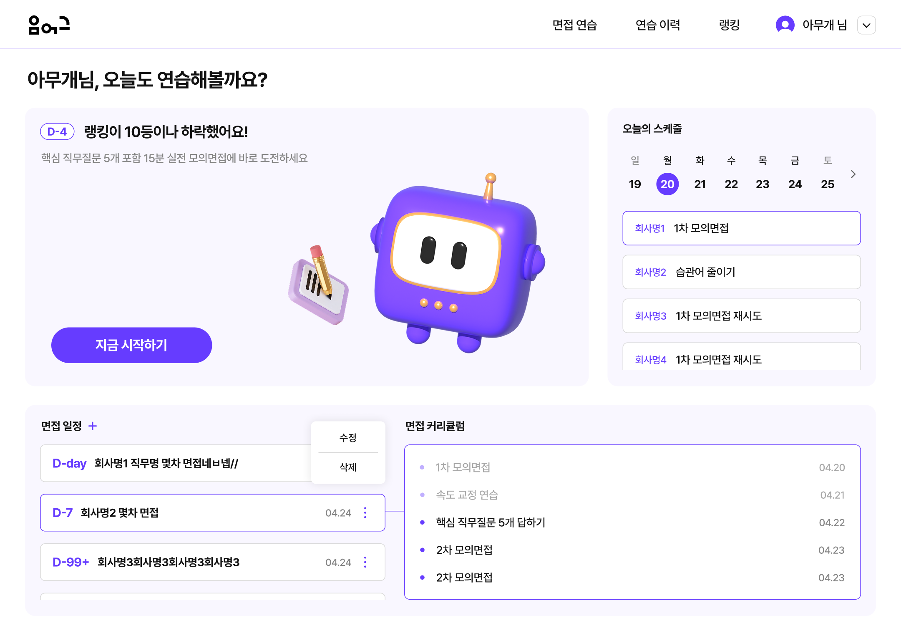
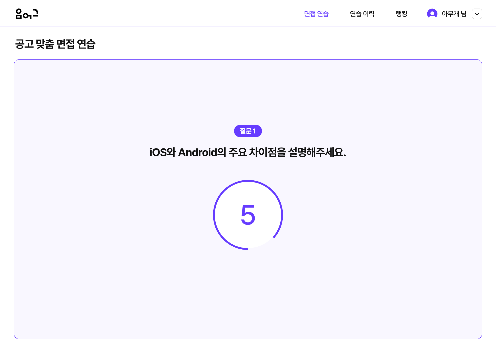
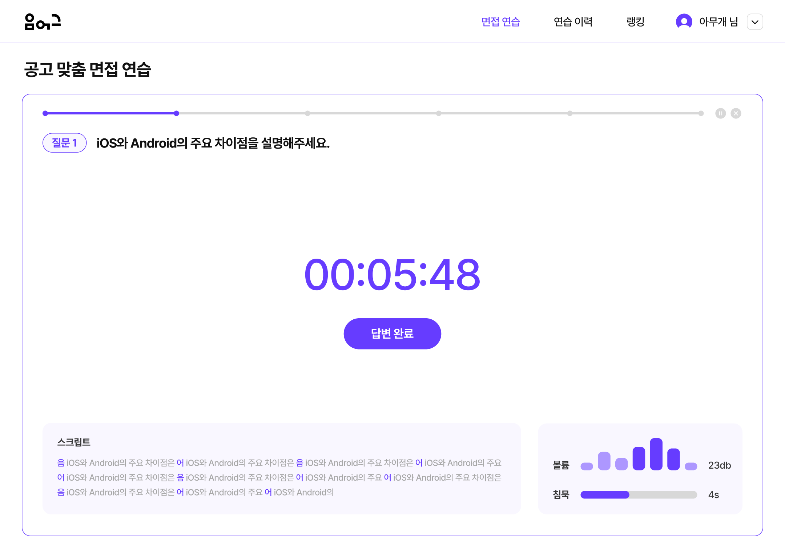
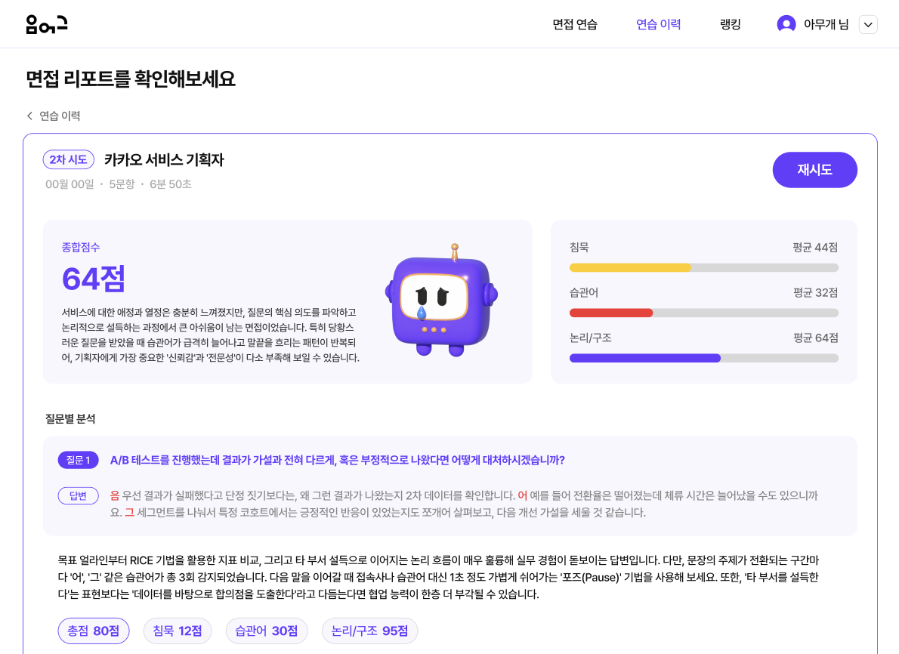
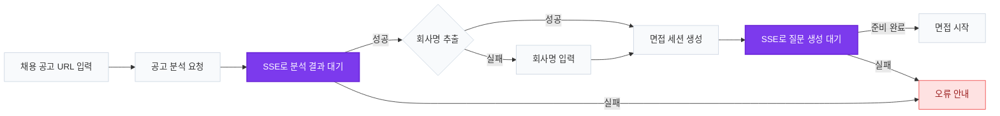

### 💬 음어그

> 채용 공고를 분석해 맞춤 면접 질문을 생성하고,  
> 답변의 습관어·침묵·논리 구조를 분석하는 AI 면접 스피치 코칭 서비스

🏆 **SWYP 웹 13기 대상 수상**

<p>
  <a href="https://u-u-g-frontend.vercel.app/">
    <strong>🌐 서비스 둘러보기</strong>
  </a>
  &nbsp;|&nbsp;
  <a href="https://blog.swyp.im/building-an-ai-interview-coach/">
    <strong>🏆 수상 인터뷰</strong>
  </a>
</p>

<details>
<summary><strong>🔑 테스트 계정 확인하기</strong></summary>

<br />

- **아이디:** `uug.swyp@gmail.com`
- **비밀번호:** `uugswyp1234!`

> 해당 계정은 서비스 체험을 위한 테스트 전용 계정입니다.

</details>

<br />



## 🚀 화면 구성

### 1. 홈 및 연습 관리

<p align="center">
  
</p>

### 2. 실시간 문답 진행

<p align="center">
  
</p>

### 3. 면접 답변 연습

<p align="center">
  
</p>

### 4. AI 분석 리포트

<p align="center">
  
</p>

## 핵심 기능

- 습관어 및 침묵 구간 실시간 감지
- 연습 중 즉각적인 시각 피드백 제공 (음량·데시벨·침묵 경고)
- 답변별 AI 분석 리포트 제공
- 연습 이력·랭킹을 통한 반복 학습 유도

<br>

## SSE 기반 면접 생성 흐름 구조도

채용 공고를 분석해 맞춤 면접 질문을 생성하고, 질문이 준비되면 면접을 시작하는 전체 흐름입니다.



### 구현 방식

- 공고 분석 : `POST /job-postings`
- 공고 분석 결과 : `SSE /job-postings/{uuid}/stream`
- 공고 상세 조회 : `GET /job-postings/{uuid}`
- 회사명 보완 : `PATCH /job-postings/{uuid}`
- 면접 세션 생성 : `POST /interview-sessions`
- 질문 생성 결과 : `SSE /interview-sessions/{uuid}/stream`

<br>

> [!NOTE]
> 공고 분석과 면접 질문 생성은 AI 모델이 수행하는 작업으로 처리 시간이 일정하지 않아 **SSE(Server-Sent Events)** 를 이용해 작업 완료 이벤트를 실시간으로 수신하도록 구현했습니다. 사용자는 별도의 새로고침 없이 진행 상태를 확인할 수 있으며, 작업이 완료되면 즉시 다음 단계로 이어집니다.
>
> 또한 공고에서 회사명을 추출하지 못하는 경우에는 사용자 입력을 받아 공고 정보를 보완한 뒤 동일한 흐름으로 면접 세션과 질문 생성을 이어가도록 설계하여 서비스 흐름이 중단되지 않도록 했습니다.
>
> 이 과정에서 **`AbortController`를 활용해 작업 완료 또는 실패 시 SSE 연결을 즉시 종료**하고, **중복 연결을 방지**하여 불필요한 네트워크 사용과 리소스 누수를 최소화했습니다.

<br>

## 🛠️ 기술 스택

### Core


### Styling


### Data Fetching


### Browser API


### Code Quality


### Testing


### Analytics


<br>

## ✨ 주요 기능

- **인증**
  - 이메일 회원가입·로그인
  - OAuth2 소셜 로그인
  - 토큰 자동 재발급

- **채용공고 맞춤 면접**
  - 원티드·잡코리아 URL 분석
  - AI 맞춤 질문 생성

- **실시간 스피치 분석**
  - 습관어
  - 음량·데시벨
  - 침묵 구간 감지

- **실시간 진행 상태**
  - SSE 기반 공고 분석
  - 질문 생성
  - 리포트 완료 상태 반영

- **AI 분석 리포트**

- **연습 이력 관리**

- **랭킹**

- **면접 커리큘럼**

- **프로필 관리**

<br>

## 🗂️ 프로젝트 구조

```text
src/
├── app/                # App Router
│   ├── (auth)/         # 비로그인 영역 (login, sign-up, reset-password, oauth2)
│   └── (main)/         # 로그인 영역 (home, interview, history, ranking, setting)
├── apis/               # 도메인별 API 클라이언트
│   └── common/         # publicClient · privateClient · refresh · httpError
├── components/         # 도메인별 UI 컴포넌트 (+ common)
├── hooks/              # useAudioAnalyzer · useSpeechRecognition · useWaitForSessionQuestions ...
├── utils/              # tokenStorage · date · reportScore ...
├── constants/          # 정규식 등 상수
├── types/              # 공통 타입
└── assets/             # 이미지 · 아이콘 · 폰트
```


## 🛠️ 시작하기

### 1. 환경 변수 설정

프로젝트 루트에 `.env` 파일을 만들고 아래 값을 채워주세요.

```bash
# 백엔드 API 베이스 URL
NEXT_PUBLIC_API_BASE_URL=http://localhost:8080/api

# Google Analytics 4 측정 ID
NEXT_PUBLIC_GA_ID=G-XXXXXXXXXX
```

### 2. 실행

```bash
bun install
bun dev
```

<br>

> [!TIP]
> 본 프로젝트는 **Bun**을 패키지 매니저 및 런타임으로 사용합니다. Node.js 대신 Bun 환경에서 실행하는 것을 권장합니다.
> `bun start`로 프로덕션 빌드를 3000번 포트에서 실행할 수 있습니다.

<br>

## 📜 Scripts

```bash
bun dev              # 개발 서버 (Turbopack)
bun build            # 프로덕션 빌드
bun start            # 프로덕션 서버 실행 (:3000)
bun test:playwright  # E2E 테스트
```
<br>

## 🧹 코드 컨벤션

```bash
bun lint         # lint (자동 수정)
bun lint:check   # lint 검사만
bun format       # 코드 포맷팅
bun type-check   # 타입 검사
```
<br>

## ✨ 특징

<br>

> [!IMPORTANT]
> 면접 질문 생성과 AI 분석은 **SSE 기반 실시간 스트림**으로 처리하여 사용자가 결과를 기다리는 동안 진행 상태를 즉시 확인할 수 있도록 구현했습니다.

- AI 기반 면접 질문 및 피드백 제공
- "음 / 어 / 그"와 같은 습관어 분석
- 리포트, 이력, 랭킹을 통한 반복 학습 지원

<br>

## 👀 타겟 사용자

- 🎓 면접을 준비하는 취업 준비생
- 💼 발표를 준비하는 직장인
- 🗣️ 말버릇을 고치고 커뮤니케이션 능력을 개선하고 싶은 사용자
